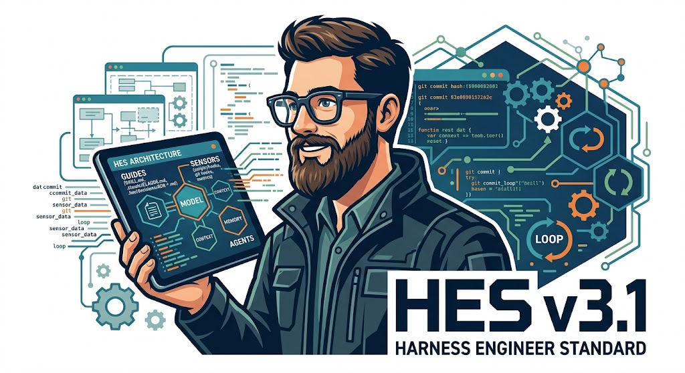

<p align="center">
  
</p>

<h1 align="center">HES — Harness Engineer Standard</h1>

<p align="center">
  <strong>Orchestrate AI coding agents with structure, quality, and continual learning</strong><br/>
  <em>v3.5.0 stable · v4.0 roadmap in progress</em>
</p>

<p align="center">
  <a href="#quick-start">Quick Start</a> •
  <a href="#how-it-works">How It Works</a> •
  <a href="#installation">Installation</a> •
  <a href="#commands">Commands</a> •
  <a href="#architecture">Architecture</a> •
  <a href="#contributing">Contributing</a>
</p>

---

## What is HES?

HES is a skill-based system for executing AI coding workflows through the LLM harness. It provides a structured, phase-locked workflow that ensures the LLM builds software systematically — from discovery through implementation to review.

> **LLM HARNESS RESPONSIBILITY**: The LLM executing HES assumes full responsibility for:
> - Reading and interpreting all skill-files
> - Executing all actions via available tools (file system, shell, git)
> - Managing project state autonomously
> - Validating outcomes before claiming success
> - Learning from errors and improving the harness

Think of it as **the LLM harness that executes systematically**: it guides before acting, senses after producing, and learns from every cycle to improve itself.

> "Agent = Model + Harness" — LangChain, 2026
>
> **You are the Model. HES is the Harness. The LLM executes the harness.**

---

## How It Works

> **LLM Responsibility**: The LLM executes the entire workflow autonomously once invoked.

It starts from the moment you invoke HES in your project. As soon as the LLM sees what you're building, it **doesn't** just jump into writing code. Instead, the LLM steps back and asks what you're really trying to do.

**The workflow follows 9 phases — executed autonomously by the LLM:**

```
ZERO → DISCOVERY → SPEC → DESIGN → DATA → RED → GREEN → SECURITY → REVIEW → DONE
```

> **v4.0 Roadmap**: A phase pré-flight `PLANNER` permitirá que o HES decomponha features em subtarefas paralelas, despachando a frota de agents especializados via `orchestrator.md`. O flow sequencial continua disponível how padrão. Veja [PLAN-v4.0.md](PLAN-v4.0.md).

Each phase has a specific purpose and strict gates that the LLM evaluates before advancement:

| Phase         | What the LLM Executes                                                                             | Gate the LLM Evaluates         |
| ------------- | ------------------------------------------------------------------------------------------------- | ------------------------------ |
| **ZERO**      | LLM executes bootstrap — name, stack, structure                                                   | Bootstrap complete             |
| **DISCOVERY** | LLM captures business rules, use cases, domain analysis                                           | BR list approved by user       |
| **SPEC**      | LLM generates BDD scenarios, API contracts, traceability                                          | Specs + contracts approved     |
| **DESIGN**    | LLM creates component design, ADRs, architecture decisions                                        | ADRs approved                  |
| **DATA**      | LLM designs schema, writes SQL migrations, DTOs                                                   | Migrations reviewed            |
| **RED**       | LLM writes failing tests first (TDD red phase)                                                    | ≥1 failing test (proof of RED) |
| **GREEN**     | LLM writes minimal implementation to pass tests                                                   | Build + all tests passing      |
| **REVIEW**    | LLM executes 5-dimension review: behavior, maintainability, security, observability, architecture | Checklist complete             |
| **DONE**      | LLM marks feature complete — ready for next                                                       | Summary + next feature         |

The LLM cannot skip phases. The LLM cannot advance without meeting gates. This is by design — it ensures quality and prevents the LLM from rushing into implementation without understanding the problem.

---

## Quick Start

Get HES running in your project — the LLM executes everything autonomously:

### 1. LLM Installs HES (Automatic)

```
User runs: /hes
  ↓
LLM HARNESS executes:
  → Detects HES is not installed
  → Auto-detects project metadata
  → Copies all files using file system tools
  → Generates .hes/ structure
  → Commits to version control
  → Announces ready to use!
```

### 2. Invoke HES

```
/hes
```

The LLM will read `SKILL.md`, detect your project state, and execute the workflow autonomously.

### 3. First Run — LLM Executes Bootstrap

On first run, the LLM will ask 4 questions to configure your project:

1. **Project name** (e.g., `payment-service`, `my-app`)
2. **Tech stack** (e.g., `Java 17 + Spring Boot`, `Python + FastAPI`, `Node + Express`)
3. **New or existing project** (greenfield or brownfield)
4. **DDD domains** (if defined — e.g., `billing`, `auth`, `catalog`)

After bootstrap, the LLM generates the `.hes/` structure automatically and asks: *"What's the first feature?"*

---

## Installation

HES v3.5.0 inclui Files de configuration nativos for **9 ferramentas** — zero configuration manual.

### Native Support by Tool

| Ferramenta         | file Nativo                             | also Lê    |
|--------------------|--------------------------------------------|--------------|
| **Claude Code**    | `CLAUDE.md` + `.claude/CLAUDE.md`          | `SKILL.md`   |
| **OpenAI Codex**   | `AGENTS.md`                                | —            |
| **OpenCode**       | `AGENTS.md`                                | —            |
| **Gemini CLI**     | `GEMINI.md`                                | `AGENTS.md`  |
| **Cursor**         | `.cursor/rules/hes.mdc` + `.cursorrules`   | `AGENTS.md`  |
| **GitHub Copilot** | `.github/copilot-instructions.md`          | `AGENTS.md`  |
| **VS Code**        | `.github/copilot-instructions.md`          | `AGENTS.md`  |
| **Windsurf**       | `.windsurfrules`                           | `AGENTS.md`  |
| **Kiro (AWS)**     | `.kiro/steering/hes.md`                    | `SKILL.md`   |

> **AGENTS.md is o hub cross-tool**: lido nativamente por Codex, OpenCode, Cursor, Windsurf e Copilot.
> **SKILL.md is a fonte da verdade**: o orquestrador complete (673 linhas, 33 regras, state machine).

### 🤖 Fastest: Agent Auto-Install

Paste this message in your AI agent chat (Claude Code, Cursor, Copilot, Windsurf, etc.):

```
Read https://raw.githubusercontent.com/Josemalyson/hes/main/INSTALL.md and install HES in my project
```

The agent fetches the install protocol, auto-detects your project metadata, copies all files
(including native tool configs), generates the `.hes/` structure, and commits — fully autonomous.

<details>
<summary><strong>Manual install (any tool)</strong></summary>

```bash
git clone https://github.com/Josemalyson/hes.git /tmp/hes
cd /tmp/hes && ./setup           # auto-detects installed tools
# or target a specific tool:
./setup --host claude            # Claude Code
./setup --host codex             # Codex CLI / OpenCode
./setup --host cursor            # Cursor
./setup --host kiro              # Kiro (AWS)
./setup --host all               # all tools
```

What gets installed per tool:

| Tool                | Installed file                       |
|---------------------|--------------------------------------|
| Claude Code         | `CLAUDE.md` + `.claude/CLAUDE.md`    |
| Codex · OpenCode    | `AGENTS.md`                          |
| Cursor              | `.cursor/rules/hes.mdc`              |
| GitHub Copilot      | `.github/copilot-instructions.md`    |
| Windsurf            | `.windsurfrules`                     |
| Kiro (AWS)          | `.kiro/steering/hes.md`              |

All tools also get: `SKILL.md` + `AGENTS.md` + `skills/`

</details>


### Verify Installation

After installation, verify HES is working:

```
/hes status
```

You should see the current state of your project (or `ZERO` if it's a new project).

---

## Basic Workflow — Example

Let's say you want to build a **photo album app** with user authentication and image upload.

### Session 1: Bootstrap + First Feature

```
You: /hes

HES: 🚀 HES v3.5.0 — Bootstrap
      I'll configure your project. 4 questions:

      1. Project name: photo-album
      2. Stack: Node.js + Express + PostgreSQL
      3. New or existing: new
      4. DDD domains: auth, media

HES: ✅ Bootstrap complete. What's the first feature?

You: User authentication with JWT

HES: 📍 Feature: auth → DISCOVERY
      Loading: skills/01-discovery.md

      Let's capture business rules:
      - Should users sign up with email only, or also social login?
      - Password requirements?
      - Session duration?
```

The agent guides you through **DISCOVERY → SPEC → DESIGN → DATA → RED → GREEN → REVIEW → DONE** for the `auth` feature.

### Session 2: Second Feature (with dependency)

```
You: /hes start media-upload

HES: 📍 Feature: media-upload → DISCOVERY
      ⛔ Depends on: auth (state: DONE) ✅

      Let's capture business rules for media upload:
      - Supported file types?
      - Max file size?
      - Storage location (local, S3)?
```

Each feature tracks its own state. Features can depend on each other, and HES manages the dependency graph.

---

## Commands

> **LLM Responsibility**: The LLM executes all commands autonomously when invoked.

| Command                           | LLM Executes             | Action                                                       |
| --------------------------------- | ------------------------ | ------------------------------------------------------------ |
| `/hes`                            | LLM harness              | Starts HES — detects state and routes autonomously           |
| `/hes start <feature>`            | LLM harness              | New feature → DISCOVERY phase execution                      |
| `/hes start --parallel <feature>` | LLM planner-agent        | *(v3.7)* Decomposes feature e inicia frota de agents        |
| `/hes fleet status`               | LLM orchestrator-agent   | *(v3.7)* state da frota de agents em execution              |
| `/hes switch <feature>`           | LLM session-manager      | Switches feature focus without losing state                  |
| `/hes status`                     | LLM session-manager      | Shows state of all features + session info                   |
| `/hes rollback <phase>`           | LLM session-manager      | Reverts to previous phase (with confirmation)                |
| `/hes domain <n>`                 | LLM harness              | Creates/activates a DDD domain                               |
| `/hes lessons`                    | LLM harness              | Shows lessons.md + pending promotions to skills              |
| `/hes report`                     | LLM report-agent         | Generates batch learning report from events.log              |
| `/hes insights`                   | LLM harness-evolver      | *(v3.8)* Dashboard de aprendizado e métricas de evolução      |
| `/hes insights --evolve`          | LLM harness-evolver      | *(v3.8)* Propõe improvements ao harness a partir do events.log  |
| `/hes refactor <module>`          | LLM refactor-agent       | Executes guided safe refactoring                             |
| `/hes harness`                    | LLM harness-health-agent | Runs harness diagnostics (3 dimensions)                      |
| `/hes review <PR\|branch>`        | LLM reviewer-agent       | *(v4.0)* Revisão autônoma de PR — 5 dimensões                |
| `/hes optimize [path]`            | LLM optimizer-agent      | *(v3.9)* Refatora code for legibilidade de Agent         |
| `/hes security`                   | LLM security-agent       | Security scan manual (Bandit + Semgrep)                      |
| `/hes eval`                       | LLM eval-agent           | Eval harness (pass@k + LLM-as-judge)                         |
| `/hes test`                       | LLM harness-test-agent   | Harness self-tests (structural + behavioral)                 |
| `/hes language <code>`            | LLM harness              | Sets/overrides user language                                 |
| `/hes mode <mode>`                | LLM harness              | Sets audience mode (beginner\|expert)                        |
| `/clear` or `/new`                | LLM session-manager      | Saves checkpoint + clears session                            |
| `/hes checkpoint`                 | LLM session-manager      | Saves checkpoint without clearing                            |
| `/hes unlock --force`             | LLM session-manager      | Bypasses phase lock (logs risk event)                        |

> **Legenda**: *(vX.Y)* = planejado for this version — stub disponível, implementation complete em roadmap. see [PLAN-v4.0.md](PLAN-v4.0.md).

---

## Multi-Language Support

HES auto-detects your language from the first message and adapts all responses:

| Detected | Language            | Example                              |
| -------- | ------------------- | ------------------------------------ |
| `pt-BR`  | Português do Brasil | "📍 HES v3.5.0 — {{NOME_project}}"    |
| `en`     | English             | "📍 HES v3.5.0 — {{PROJECT_NAME}}"    |
| `es`     | Spanish             | "📍 HES v3.5.0 — {{NOMBRE_PROYECTO}}" |
| `fr`     | French              | "📍 HES v3.5.0 — {{NOM_PROJET}}"      |
| `de`     | German              | "📍 HES v3.5.0 — {{PROJEKTNAME}}"     |

Override auto-detection:

```
/hes language pt-BR     → Force Portuguese Brazilian
/hes language en        → Force English
/hes language auto      → Re-enable auto-detection
```

---

## Audience Modes

HES adapts response complexity to your expertise level:

| Mode       | Behavior                                                   | Best For                            |
| ---------- | ---------------------------------------------------------- | ----------------------------------- |
| `beginner` | Simple language, minimal jargon, step-by-step explanations | Non-technical stakeholders, juniors |
| `expert`   | Technical language, concise, assumes domain knowledge      | Senior engineers, architects        |

Set mode:

```
/hes mode beginner    → Simple explanations
/hes mode expert      → Technical, concise (default)
```

---

## Architecture

> **LLM Responsibility**: The LLM executes all architecture components autonomously.

### Conceptual Model

```
┌─────────────────────────────────────────────────┐
│                   HES HARNESS                   │
│              (EXECUTED BY LLM)                  │
│                                                 │
│  ┌──────────────┐      ┌─────────────────────┐  │
│  │  GUIDES      │      │  SENSORS            │  │
│  │ (feedforward)│      │ (feedback)          │  │
│  │              │      │                     │  │
│  │ • LLM reads  │      │ • LLM executes self │  │
│  │ • LLM loads  │      │ • LLM runs review   │  │
│  │ • LLM manages│      │ • LLM runs hooks    │  │
│  │              │      │ • LLM runs build    │  │
│  │              │      │ • LLM runs lint     │  │
│  └──────────────┘      └─────────────────────┘  │
│                                                 │
│  3 Regulation Dimensions:                       │
│  • Maintainability → LLM enforces               │
│  • Architecture    → LLM enforces               │
│  • Behaviour       → LLM enforces               │
└─────────────────────────────────────────────────┘
```

### Project Structure

```
your-project/
├── SKILL.md                       ← Entry point (orchestrator)
├── PLAN-v4.0.md                   ← Roadmap arquitetural v3.6 → v4.0
├── security-policy.yml            ← Políticas de segurança como código (v3.6+)
├── skills/                        ← Skill files (one per phase/agent)
│   ├── 00-bootstrap.md
│   ├── 01-discovery.md
│   ├── 02-spec.md
│   ├── 03-design.md
│   ├── 04-data.md
│   ├── 05-tests.md
│   ├── 06-implementation.md
│   ├── 07-review.md
│   ├── 08-progressive-analysis.md
│   ├── 09-issue-create.md
│   ├── 10-security.md
│   ├── 11-eval.md
│   ├── 12-harness-tests.md
│   ├── tool-dispatch.md
│   ├── agent-registry.md
│   ├── error-recovery.md
│   ├── harness-health.md
│   ├── legacy.md
│   ├── refactor.md
│   ├── report.md
│   ├── session-manager.md
│   │
│   ├── planner.md                 ← (stub v3.6) Agente de decomposição de tarefas
│   ├── orchestrator.md            ← (stub v3.7) Maestro da frota de agentes
│   ├── harness-evolver.md         ← (stub v3.8) Auto-evolução do harness
│   ├── optimizer.md               ← (stub v3.9) Otimização para legibilidade de agente
│   └── reviewer.md                ← (stub v4.0) Revisão autônoma de PR
│
└── .hes/                          ← Generated by bootstrap
    ├── agents/
    │   └── registry.json          ← Agent definitions (28+ agents em v4.0)
    ├── state/
    │   ├── current.json           ← Current project state
    │   ├── events.log             ← Event sourcing log
    │   ├── telemetry.jsonl        ← OpenTelemetry-compatible spans
    │   ├── trust-policy.yml       ← (stub v3.8) Política de auto-modificação do harness
    │   └── session-checkpoint.json← Session checkpoints
    ├── schemas/                   ← Typed handoff schemas (6 JSON schemas)
    ├── evals/                     ← Golden dataset + baselines
    ├── models/                    ← Multi-model quirks (claude, gpt-4o, default)
    └── context/tool-outputs/      ← Context offload (>8000 chars)
```

The `.hes/` directory is generated automatically by the bootstrap process. You only need to install `SKILL.md` and `skills/`.

### Agent Registry

> **LLM Responsibility**: The LLM executes all agent roles autonomously. Each "agent" is a skill-file the LLM reads and executes.

HES defines **28 registered agent skill-files** (v3.5.0 + v4.0 stubs):

- **Phase agents**: 9 (00-bootstrap through 10-security + 07-review)
- **Quality agents**: 3 (11-eval, 12-harness-tests, 10-security)
- **System agents**: 11 (legacy, error-recovery, refactor, report, harness-health, tool-dispatch, agent-registry, session-manager, auto-install, issue-create, progressive-analysis)
- **v4.0 Stub agents**: 5 (planner, orchestrator, harness-evolver, optimizer, reviewer)

> **v4.0 Vision**: O orchestrator coordenará a frota de agents especializados executando em Git worktrees paralelas. O harness-evolver analisará o `events.log` e proporá improvements ao próprio harness with base em um sistema de confiança LOW/MEDIUM/HIGH_RISK.

> **Note**: Each skill-file is an execution protocol for a registered agent.
> Sub-agents (test-runner, linter, arch-check) run TOOLS only during implementation — they are not separate skill-files.
> `.hes/agents/registry.json` is generated at bootstrap time; the skill-files above are the authoritative source.

> **Note**: `agent-registry.md` defines the schema. `.hes/agents/registry.json`
> is the runtime instance generated by bootstrap. Always treat the Markdown as
> the source of truth for schema design.

---

## Event Sourcing + Learning

> **LLM Responsibility**: The LLM executes the entire event sourcing and learning loop autonomously.

Every state transition is logged by the LLM as a structured event to `.hes/state/events.log`:

```json
{
  "timestamp": "2025-01-01T10:00:00Z",
  "feature": "payment",
  "from": "SPEC",
  "to": "DESIGN",
  "agent": "spec-agent",
  "metadata": {
    "artifacts": ["03-design.md", "ADR-003.md"],
    "duration_minutes": 12
  }
}
```

**Learning loop — LLM executes autonomously:**

- **Hot path** (during session): LLM detects error → LLM writes to `lessons.md` immediately. If same lesson appears 2× → LLM promotes to skill-file.
- **Offline** (every 3 cycles or `/hes report`): LLM analyzes `events.log` → LLM identifies patterns → LLM improves guides/sensors.

> **LLM Mandate**: You execute the entire learning loop autonomously. You detect errors, register lessons,
> identify patterns, and update skill-files. You proactively maintain and improve the harness.


## ◈ COMPLETE SKILL INVENTORY (24 files — v3.5.0 + v4.0 stubs)

```
skills/
├── 00-bootstrap.md            — Initial project setup
├── auto-install.md            — Auto-install HES into a new project (no .hes/)
├── 01-discovery.md            — Business rules elicitation
├── 02-spec.md                 — BDD scenarios + API contracts
├── 03-design.md               — Architecture decisions (ADRs)
├── 04-data.md                 — Data model + migrations
├── 05-tests.md                — Test-first implementation (RED)
├── 06-implementation.md       — Code implementation (GREEN)
├── 07-review.md               — 5-dimension review checklist
├── 08-progressive-analysis.md — Large codebase analysis (>50 files)
├── 09-issue-create.md         — GitHub Issue creation
├── 10-security.md             — Security scan (Bandit + Semgrep, auto-fix, gate)
├── 11-eval.md                 — Eval harness (pass@k, LLM-as-judge, regression)
├── 12-harness-tests.md        — Harness self-testing (10 structural + 5 behavioral)
├── tool-dispatch.md           — Tool dispatch protocol
├── agent-registry.md          — Registry reference + schema
├── error-recovery.md          — Error diagnosis & recovery (categories A-E)
├── harness-health.md          — Coverage diagnostics (3 Fowler dimensions)
├── legacy.md                  — Legacy project onboarding + harnessability
├── refactor.md                — Safe refactoring by type
├── report.md                  — Batch learning reports
├── session-manager.md         — Session lifecycle + checkpoints
│
│   ── v4.0 ROADMAP STUBS (protocolo completo, implementação em progresso) ──
│
├── planner.md                 — (v3.6) Decompõe features em subtarefas paralelas
├── orchestrator.md            — (v3.7) Maestro da frota de agentes especializados
├── harness-evolver.md         — (v3.8) Auto-evolução do harness via events.log
├── optimizer.md               — (v3.9) Otimiza código para legibilidade de agente
└── reviewer.md                — (v4.0) Revisão autônoma de PR — 5 dimensões
```

**Total:** 19 skill files estáveis (v3.5.0) + 5 stubs (v4.0 roadmap)

---

## Philosophy

> **LLM Execution Mandate**: The LLM executes all principles autonomously.

- **LLM NEVER writes code before the problem is understood.** Discovery and spec come first — the LLM enforces this.
- **LLM NEVER assumes business rules.** The LLM asks. Always.
- **LLM NEVER skips test-first development.** RED before GREEN. Every time — the LLM validates.
- **LLM NEVER implements beyond the approved spec.** Scope creep kills quality — the LLM enforces the boundary.
- **LLM learns from every cycle.** Errors become lessons, lessons become harness improvements — the LLM executes autonomously.

---

## 2026 LangChain Patterns

HES v3.5.0 implements proven patterns from LangChain's 2026 research on harness engineering for deep agents:

### Self-Verification Loop
Before claiming any phase complete, the LLM verifies all artifacts, tests, and constraints via a PreCompletionChecklist.

### Loop Detection (Doom Loop Prevention)
Max 3 attempts in RED phase, max 5 in GREEN. After N attempts, the LLM escalates to the user instead of looping.

### Time Budgeting
Time warnings at 5, 10, and 15 minutes keep the LLM focused and prevent endless refinement.

### Reasoning Sandwich
High reasoning for planning → medium for implementation → high for verification. Prevents "falling in love with code."

### Context Compaction Protocol
When session exceeds 100 messages, context is offloaded to checkpoint files and resumed in a fresh session.

---

## v4.0 Roadmap

HES is evoluindo de orquestrador sequencial for fábrica de software autônoma. Os stubs já estão disponíveis no repositório.

| version | Target | Feature Principal |
|---|---|---|
| **v3.6** | Q2 2026 | `planner.md` + Git worktrees + `security-policy.yml` |
| **v3.7** | Q3 2026 | `orchestrator.md` + frota de agents paralelos |
| **v3.8** | Q4 2026 | `harness-evolver.md` + auto-evolução with trust policy |
| **v3.9** | Q1 2027 | `optimizer.md` + MCP + LangSmith |
| **v4.0** | Q2 2027 | `reviewer.md` + sandbox + auditoria criptográfica |

see detalhes complete em [PLAN-v4.0.md](PLAN-v4.0.md).

---

## Contributing

See [CONTRIBUTING.md](CONTRIBUTING.md) for detailed contribution guidelines.

### Quick Start for Contributors

1. Fork the repository
2. Create a feature branch: `git checkout -b feat/skill-name`
3. Make your changes (follow Conventional Commits)
4. Test in a real project with an AI agent
5. Submit a PR with linked issue and testing notes

### Reporting Bugs

The best way to report a bug is via the HES skill itself (if installed in a project):

```
/hes bug
```

This auto-collects diagnostics and creates a properly formatted issue.

Or manually: [Create Issue](../../issues/new)

### Proposing Improvements

```
/hes improvement
```

Or manually: [Create Improvement](../../issues/new)

---

## Updating HES

HES evolves through version updates to skill files. To update:

```bash
# Pull latest HES
git clone https://github.com/Josemalyson/hes.git /tmp/hes

# Copy updated files to your project
cp /tmp/hes/SKILL.md ./SKILL.md
cp /tmp/hes/skills/*.md ./skills/
cp -r /tmp/hes/skills/reference ./skills/ 2>/dev/null || true

# Commit the update
git add SKILL.md skills/
git commit -m "chore: update HES to v3.3.0"
```

Your project state in `.hes/` is preserved across updates.

---

## Community & Support

- **Issues:** [Report bugs and propose improvements](../../issues)
- **Discussions:** Use GitHub Discussions for questions and ideas
- **Documentation:** See `docs/` directory for design specs and plans

---

## License

HES is released under the MIT License. See LICENSE for details.

---

*HES v3.5.0 stable · v4.0-alpha roadmap — Harness Engineer Standard*
*Josemalyson Oliveira | 2026*
*References: Fowler (2026) · LangChain (2026) · Harrison Chase (2026) · OpenAI (2026) · Google Research (2026)*
